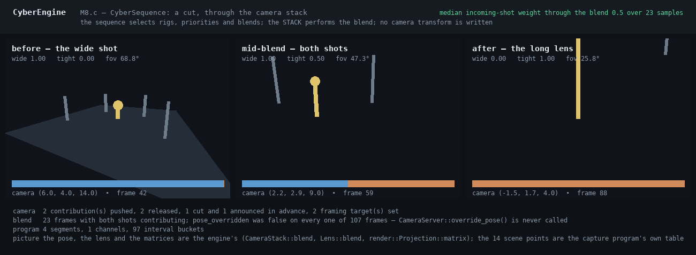

# src/sequencing/ — CyberSequence

Compiled timelines that orchestrate camera, animation, audio, effects, materials, lighting,
environment, interface and gameplay — **and own none of them**. M8.c section 3;
`sequencing-and-cinematics`.

## What is here

| Target | What it is | Depends on |
|---|---|---|
| `cy::sequencing` | Exact time, the authored model, the compiler and its two indexes, the compiled program, evaluation into per-subsystem batches, arbitration, capture and restore, seeking, skipping, the preload plan | `cy::core` only |
| `cy::sequencing-camera` | The bridge: a camera batch becomes camera stack contributions, blends and cuts | `cy::servers-camera` |
| `cy::sequencing-gameplay` | The bridge: a command batch becomes gameplay commands through the one door | `cy::gameplay` |
| `artefact/` | `cy_sequence_cut-capture` and `cut.py` — the cut, captured mid-blend, and `smoke.sequence_cut` | both bridges |

**The dependency column is the specification's first requirement made structural.** "Sequences
orchestrate, they do not own": a sequence "SHALL NOT contain its own camera evaluation, animation
playback, audio playback, effect simulation, environment state, or gameplay state", and "There SHALL
NOT be a cinematic-only implementation of any subsystem the engine already provides." `cy::sequencing`
depends on `cy::core` and nothing else, so it *cannot* contain a camera evaluation — the header is
not on its include path. What it produces is values in a batch, and the two bridges that may name a
subsystem are one file each that nothing else links.

## The five things worth knowing before reading the code

1. **A sequence is not a node graph, and that is measured rather than argued.** M8.b's spike found
   that a timeline cannot lower through the shared pure-expression core — it is a hash-consed DAG
   that re-sorts commutative operands and deletes values nothing reads, and an authored track order
   is exactly what must not be re-sorted. So CyberSequence adopts CyberGraph for nothing at all. See
   `openspec/changes/implement-m8c-spectacle/design.md` §1.
2. **Time is an integer count of subframe ticks** (`time.h`). A cinematic that loops for hours
   accumulates one rounding error per advance in a float, and — worse than wrong — the instant
   reached by playing would differ from the instant reached by seeking. The wall clock is a float at
   the boundary and nowhere inside: `TimeAccumulator` takes integer nanoseconds and carries the
   sub-tick remainder exactly. The play rate is a *rational* for the same reason.
3. **Cost scales with what is active, and the two indexes are where that is decided**
   (`program.h`). The interval index is a bucket array — one division and one contiguous walk — and
   the event index is a sorted array, so the events an interval crossed are a *span* and a four-minute
   seek costs what a frame costs. A million authored keys cost a million keys' memory and nothing
   per frame.
4. **Every "SHALL fail" scenario is a compile-time refusal with a diagnostic code**
   (`compile.h`), and each has a test that breaks the rule and watches it go red.
5. **A camera is driven through the camera stack, and there is nowhere to write a transform.**
   `CameraRequest` carries a rig selection, a priority, a weight, a blend policy and a cut — and no
   pose. A camera *binding* driven by anything but a camera track fails to compile. See below.

## The camera, which is the milestone's exit criterion

> A sequence drives cameras through the camera stack and does not write camera transforms.

Three independent things make that true rather than intended:

- **The compiler refuses it.** A binding declared `BindingKind::Camera` accepts only
  `TrackKind::Camera` and `TrackKind::CameraCut`; a transform track pointed at a camera is
  `DiagnosticCode::CameraTransformWritten`, naming the track.
- **The batch has no field for it.** `CameraRequest` would need a new member, which is a change a
  reviewer sees.
- **The bridge calls four things**: `CameraStack::push`, `CameraStack::release`,
  `CameraServer::cut` and `CameraServer::set_target`. Never `override_pose`, which is the one call
  `camera-system` reserves for "low-level debug and custom node code".

**A shot changes lens by selecting a rig.** `cy::camera` has no per-rig lens setter — a lens is the
`Lens` node of a rig's compiled definition — so a wide shot and a long-lens shot are two rigs, and
cutting between them is the stack blending two evaluated cameras whose lenses differ. That is
`camera-system`'s own model ("lens blending SHALL respect the lens model in use"), and it is why the
captured blend moves the field of view as well as the position.

`docs/design/images/m8c-sequence-cut.png` is that capture. The camera in it is the engine's: the pose
is `CameraStack::blend`'s over two evaluated rigs, the field of view is `Lens::blend`'s, the matrices
are `render::Projection::matrix()`'s, and the weight bars are the stack's own contribution report.
**The fourteen scene points are the capture program's own table**, which the image says on its own
face — this section owns a camera, not a renderer, and M8.b's gate found an artefact that took its
silhouettes from the sample's table and "would have drawn a defect correctly".

## Deviations, and things that were decided rather than assumed

- **`ChannelType::Transform` is declared and refused.** The specification names transform as a
  channel type; a transform authored as one key would make every scalar channel carry ten floats for
  the one case that needs them, and Euler triples interpolate wrongly. `add_transform_channels()`
  authors it as `position` (vector), `rotation` (rotation) and `scale` (vector) — the three that
  interpolate correctly — and the compiler's diagnostic names that function.
- **A rotation channel uses `nlerp` on the short arc**, not `slerp`, matching the animation runtime's
  own choice for the same reason. The hemisphere check is not an optimisation: without it two keys
  either side of a half turn interpolate the long way and the camera spins.
- **Arbitration normalises within a priority level.** Blend groups are recorded on every
  contribution and reported, but the normalisation is per (target, property, priority) rather than
  per group; two groups at one priority therefore mix rather than competing. The requirement's core —
  "declared arbitration ... not by last writer" — is priority, weight and exclusive group, and all
  three are implemented and tested.
- **A "future camera bound" is published as an identity and a deadline, not as a world bound.** This
  module names no world, so `FutureShot` carries the rig and framing-target identities and the ticks
  until the shot; the camera bridge turns an anticipated cut into `CameraServer::cut(..., anticipated)`
  and the camera's own `StreamingSource` carries it to residency. Closing the loop any further would
  need this module to know what a world position is.
- **Entering a section and preparing for one are different questions.** A section with a pre-roll is
  in the active set long before it starts. The first version of `enter_sections` asked only whether
  the segment was newly active, so the pre-roll fired and the section itself never did — the capture
  found it, because the cut was announced and then never happened. `tests/test_playback.cpp` keeps
  it found.
- **The bridge applies the live requests before the releases**, and skips a live request whose
  binding *and* rig are also being released. A sequence's last frame both evaluates its final shot
  and completes, so the batch carries the shot and its release together; a shot *change* on one
  binding is the case that stops this from being "releases always win".

## What is NOT here, and is honestly absent rather than stubbed

`sequencing-and-cinematics` has thirty-one requirements. What this milestone implemented is listed
above; what it did not is listed here, because a specification cell that says Working over a gap
nobody wrote down is how a capability rots:

- **Source form, semantic diff and three-way merge.** Every authored object carries a `stable_id`,
  which is what a diff and a merge address — but there is no text form, no diff and no merge. That is
  an editor feature with an editor's test surface.
- **Replication and late join.** `NetworkPolicy` is declared and validated against adapter
  properties at compile time; nothing replicates a sequence, and `networking-and-replication` is
  where that transport lives.
- **Persistence.** `PersistenceClass` is declared and carried; no save format writes it.
- **Replay and rollback reconciliation.** Events carry a `SideEffectPolicy` and the seek modes read
  it, which is the half this module owns; the side-effect ledger is `replay-and-rollback`'s.
- **Reverse playback of channels.** A negative `PlayRate` runs the clock backwards exactly and is
  tested; adapters are not run backwards, and no case asserts a reversed evaluation.
- **Track-kind extension by plugins.** A plugin can register an ADAPTER with its own declared
  properties and the compiler validates every one of them; it cannot register a new `TrackKind`.
